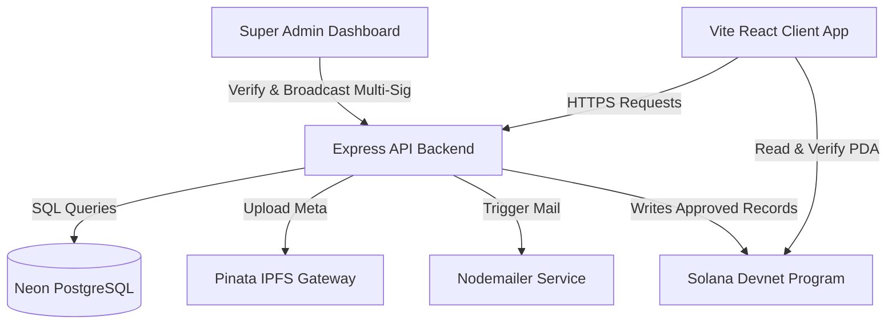
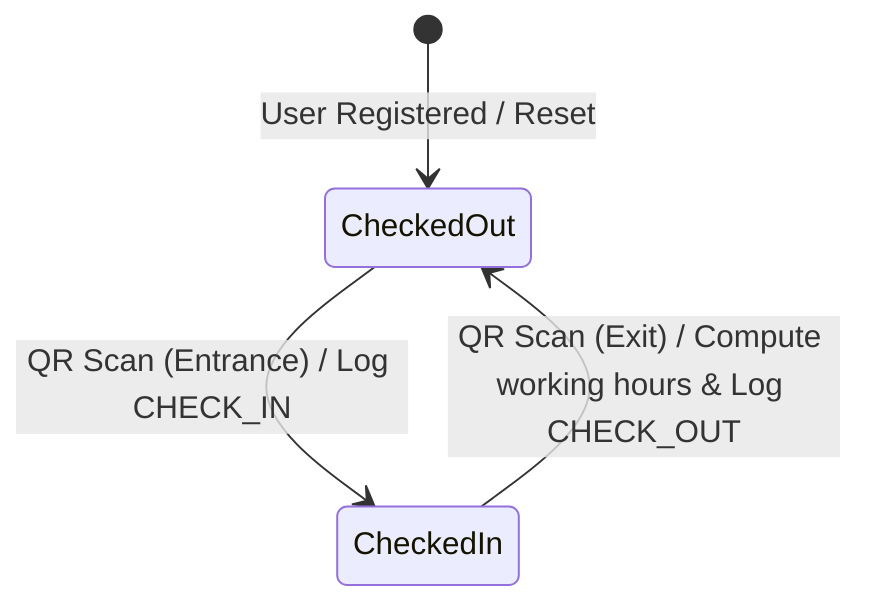
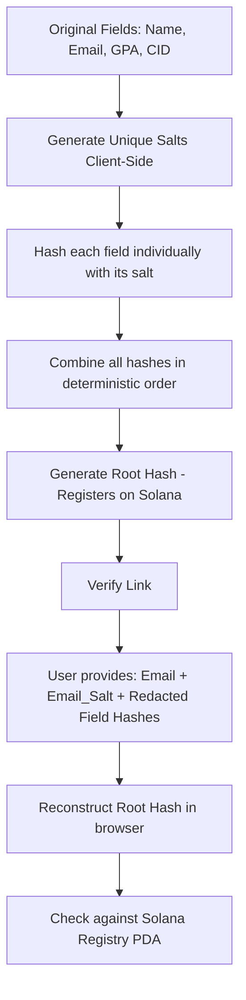

# 🔗 PROOFCHAIN: ENTERPRISE DOCUMENT REGISTRATION AND ATTENDANCE SYSTEMS
## COMPREHENSIVE ARCHITECTURAL DESIGN AND SYSTEM REQUIREMENTS SPECIFICATION
### 🌟 VERSION TWO POINT ZERO - PRODUCTION READY MANUAL

  
  
  
  
  
  
  
  
  
  
  

---

## ⚡ SECTION 1: INTRODUCTION AND EXECUTIVE SUMMARY

ProofChain is a highly scalable, enterprise-grade hybrid document verification, signature attestation, and automated workforce attendance system. By combining the cryptographic trust of the Solana Devnet blockchain with the cost-effective and immutable storage capabilities of the InterPlanetary File System, the platform delivers verifiable credential proofing without compromises in speed, cost, or security. 

Beyond core cryptographic document issuing and verification, the platform features a complete multi-signature approval pipeline, zero-knowledge selective disclosure, and a fully automated check-in and check-out attendance system. The attendance system tracks employee logins and camera-based QR scans, automatically computing shift durations, active sessions, and working hours, which are securely compiled into Excel spreadsheets reserved exclusively for the platform's Super Admins.

The primary objective of the ProofChain platform is to bridge the gap between centralized databases and decentralized ledgers. Centralized systems suffer from vulnerabilities such as single-point-of-failure database tampering, while fully decentralized architectures suffer from high latency, expensive transaction fees, and lack of searchability. ProofChain addresses this by implementing a Web2 cache metadata layer using PostgreSQL, synced automatically with the Solana ledger. Any document verified on the platform is hashed locally inside the user's browser, meaning raw files are never transmitted or uploaded during the verification process, preserving complete data confidentiality.

---

## 📋 SECTION 2: SYSTEM REQUIREMENTS SPECIFICATION (SRS)

<b>🔍 Tap to Expand SRS Specifications</b>

### 2.1 PRODUCT SCOPE
The software product operates in a Web3 browser environment, utilizing cryptographic keypairs generated by the Solana wallet adapter alongside standard session tokens generated by a JSON Web Token microservice. The system consists of three distinct client dashboards optimized for different privilege tiers, a public-facing verification gateway, a secure backend API, a relational database cache, and a smart contract deployed on the Solana Devnet.

### 2.2 USER CLASSES AND PRIVILEGE LEVELS
The system recognizes three categories of authenticated accounts, plus one unauthenticated visitor class:

1. **Super Admin (Tier One):**
   - The absolute authority on the platform.
   - Responsible for review and confirmation of multi-signature document requests submitted by Admins.
   - Manages platform-wide access, including upgrading standard users to Admins or Super Admins, and revoking Admin access.
   - Observes global system activity through the platform's audit ledger.
   - Exports employee log data, login histories, and paired shift calculations as Excel-compatible CSV sheets.

2. **Admin (Tier Two):**
   - Authorized to register new documents and certificates.
   - Performs heuristic AI classification on certificates, extracting document tags, types, and keywords locally prior to registry.
   - Performs bulk uploads of certificates via CSV template parsing, triggering asynchronous background registry pipelines.
   - Can issue documents directly if single-signature registration is allowed, or queue documents into the Multi-Sig pipeline if additional validation is required.
   - Can revoke previously issued certificates, triggering Solana transactions that modify ledger state.

3. **User / Employee (Tier Three):**
   - Represents the standard account assigned to recipients of certificates and company employees.
   - Can view all active certificates issued to their unique email address.
   - Can cryptographically sign certificate verification requests using their Phantom Wallet to prove ownership of the matching private key.
   - Accesses a personal QR Attendance Card that contains their unique system identifier.
   - Displays this QR card at physical corporate entry points to log shift attendance automatically.
   - Can configure Zero-Knowledge Selective Disclosure links to share specific certificate attributes (e.g., name only) while redacting sensitive details.

4. **Public Verifier (Visitor Tier):**
   - Unauthenticated guest users who access the `/verify` portal.
   - Verifies the validity of any document by dragging and dropping the file.
   - Verifies partial credentials shared via ZK links by checking the provided hashes and salts against the on-chain root hash.

### 2.3 FUNCTIONAL REQUIREMENTS
1. **Cryptographic Identity Management:**
   - The system must link standard user logins to Solana wallet addresses.
   - Users must be able to bind their Phantom Wallets to prove document ownership.

2. **Decentralized Storage (IPFS) Pipeline:**
   - Raw certificates uploaded by admins must be stored on IPFS.
   - The system must generate unique IPFS Content Identifiers (CIDs) representing the metadata schema.

3. **On-Chain Document Registry:**
   - The Solana smart contract must register document records as Program Derived Addresses (PDAs) using the SHA-256 file hash as a seed.
   - Each registered document must store the issuer's public key, the IPFS CID, registration timestamp, and the revocation status.

4. **Multi-Signature Approval Workflow:**
   - Multi-sig document registrations must store intermediate transaction states in the database.
   - The Super Admin must be able to review, sign, and broadcast these transactions to the Solana ledger.

5. **Real-Time Revocation Synchronization:**
   - When an Admin revokes a certificate, the system must broadcast a transaction updating the ledger status to revoked.
   - Both the Admin and User dashboards must query the ledger in real-time and immediately filter out revoked certificates.

6. **Automatic QR Attendance Tracker:**
   - The login page must feature a toggle to activate a web-camera QR code scanner.
   - The scanner must read the employee's ID from their dashboard QR card.
   - The system must determine if the employee is checking in or checking out by checking their last audit state.
   - The system must compute shift durations on checkout and notify the user instantly.

7. **Audit Logging & Report Exportation:**
   - The database must record logins, checks, registration actions, and IP addresses.
   - The Super Admin must be able to download separate reports: raw login logs and computed employee working hour sheets.

### 2.4 NON-FUNCTIONAL REQUIREMENTS
1. **Performance & Latency:**
   - Web2 cached queries (such as listing available documents) must resolve in under one hundred milliseconds.
   - Web3 queries must poll the Solana RPC validator cluster and resolve transaction confirmations within five seconds.
   - Local document hashing via Web Crypto API must execute in under fifty milliseconds for files under fifty megabytes.

2. **Security & Confidentiality:**
   - The database must never store plain-text passwords; all passwords must be hashed using bcrypt with a work factor of ten.
   - JWT tokens must expire after twenty-four hours to mitigate token theft attacks.
   - API endpoints must be protected with role-based check middleware.
   - Sensitive endpoints (like document uploads) must enforce rate limiting to prevent denial-of-service attempts.

3. **Scalability:**
   - Database tables must use composite indexes to ensure rapid queries under millions of log records.
   - The frontend must register a service worker to leverage PWA caching, offloading asset delivery from the server.

4. **Compatibility & Responsiveness:**
   - The system must be fully responsive, rendering correctly on mobile screens (for scanner usage) and desktop screens.
   - The frontend must run on all modern browsers supporting the Web Crypto API and WebRTC camera stream protocols.

---

## 🛠️ SECTION 3: SYSTEM ARCHITECTURE AND TECH STACK

<b>📐 Tap to Expand System Architecture Flowcharts & Stack</b>

### 3.1 CORE SYSTEMS INTERACTION MAP

### 3.2 DETAILED TECH STACK DIRECTORY
The platform is built using the following technologies:

- **Core Technologies:**
  - **Structure:** HTML5 standard elements for semantics.
  - **Styling:** Custom CSS with dark mode variables, hover animations, and glassmorphic designs.
  - **Runtime Framework:** React with Vite build tool.

- **Frontend Dependencies:**
  - **Routing:** React Router DOM for routing.
  - **State Management:** Custom React Context providers for session tracking.
  - **Visual Dashboards:** Recharts library for charting growth and issuance metrics.
  - **Icons:** Lucide React.
  - **CSV Parser:** PapaParse for bulk uploads and CSV exporting.
  - **QR Code Rendering:** QRCode.react for canvas-based QR card displays.
  - **QR Code Scanning:** Html5-qrcode wrapper for camera capture and stream decoding.
  - **Solana Web3 Interface:** `@solana/web3.js` and `@solana/wallet-adapter-react`.
  - **Anchor Framework Integration:** `@coral-xyz/anchor`.

- **Backend Architecture:**
  - **Runtime environment:** Node.js.
  - **API Framework:** Express.js.
  - **Object Relational Mapper:** Prisma ORM.
  - **Security Tools:** bcryptjs for credentials, jsonwebtoken for sessions, express-rate-limit for abuse prevention.
  - **Mail Dispatcher:** Nodemailer with dynamic Ethereal Mail fallbacks.
  - **File Handler:** Multer for memory buffers during upload streams.

- **Blockchain Environment:**
  - **Smart Contract Language:** Rust.
  - **Blockchain SDK:** Anchor Framework.
  - **Target Network:** Solana Devnet.

- **Infrastructure & Storage:**
  - **Relational Database:** PostgreSQL hosted on Neon.
  - **Decentralized Storage:** Pinata IPFS Gateway.
  - **Frontend Hosting:** Netlify.
  - **Backend Hosting:** Railway.app.

---

## ⚙️ SECTION 4: DETAILED COMPONENT SPECIFICATIONS

<b>🔧 Tap to Expand Detailed Component Workings</b>

### 4.1 THE FRONTEND CLIENT APPLICATION (VITE + REACT)
The frontend application acts as the hub for user interactions. It is responsive and handles local cryptographic operations to ensure maximum user privacy.

#### 4.1.1 Local Hashing Engine
The local hashing engine uses the browser's native Web Crypto API. When an admin uploads a certificate or a visitor drops a file to verify it, the engine calculates the SHA-256 hash locally. This client-side hashing ensures that the contents of a file are never sent to the network for verification, providing a high level of security.

#### 4.1.2 Zero-Knowledge Proof (ZKP) Simulator
The ZKP simulator allows users to verify specific claims of a credential without revealing the full dataset. Using SHA-256 hashing and unique random salts for each metadata field (e.g. name, email, role), the component generates a set of hashes. If a user only wants to share their email, the simulator exposes the email and its salt, but provides only the raw hashes of the redacted fields. The verifier combines these to reconstruct the root hash, which is checked against the on-chain registry to confirm the credential's validity.

#### 4.1.3 Progressive Web App (PWA) Layer
The PWA layer consists of a service worker and a manifest file. The service worker caches key assets like HTML, CSS, logos, and scripts, allowing the application to load quickly even under unstable connections. This is especially useful for mobile device screens when scanning employee QR codes.

---

### 4.2 THE BACKEND API MICROSERVICE (NODE.JS + EXPRESS)
The backend service processes business logic, handles database operations through Prisma, and interacts with external services like Pinata IPFS and Nodemailer.

#### 4.2.1 Authentication & Authorization
The authentication system secures endpoints using JWT. When a user logs in, the backend validates their credentials against the PostgreSQL database using bcrypt. If verified, it returns a JWT containing their user profile and role privileges, which is sent along in the header of subsequent requests.

#### 4.2.2 Document Upload & AI Heuristics
When an Admin registers a document, the backend receives the file stream via Multer, validates it against rate limits, and processes it. Heuristic rules inspect the file metadata and name to generate automated category tags and keywords. The file is then uploaded to Pinata IPFS to obtain a permanent content identifier (CID), and a database request record is created.

#### 4.2.3 Automatic Email Service
The email service is powered by Nodemailer. When a certificate is registered on the blockchain, the backend dispatches a verification notification containing the dynamic verification URL, the document hash, and the IPFS CID link. If no custom SMTP credentials are provided, the service falls back to generating an Ethereal Mail sandbox account and printing the preview link in the backend console logs.

---

### 4.3 THE BLOCKCHAIN LAYER (SOLANA PROGRAM)
The blockchain program is written in Rust using the Anchor framework, managing registration states on the Solana ledger.

#### 4.3.1 Account PDA Structure
Document accounts on Solana are derived dynamically using the string literal `document` and the unique 32-byte file hash as seeds. This allows the frontend to derive the account address directly, without needing to look up a map index.

#### 4.3.2 On-Chain Registration
The registration function registers the document hash, issuer address, IPFS CID, and timestamp to the derived PDA. If a PDA is already initialized, the transaction is rejected, preventing double-registration.

#### 4.3.3 On-Chain Revocation
The revocation function allows the issuer to mark a document account as revoked. The smart contract validates that the transaction signer matches the issuer address saved in the PDA account before writing the change.

---

### 4.4 THE PERSISTENCE LAYER (NEON POSTGRESQL)
The Neon PostgreSQL database acts as a Web2 metadata cache. It stores user accounts, system configuration states, pending multi-sig registration requests, and audit logs.

#### 4.4.1 Schema Indexing
To keep query times fast as audit records grow, the schema applies compound database indexes on frequently queried columns:
- **`AuditLog`**: Indexes are set on the user identifier and action columns, ensuring quick loads of user-specific histories.
- **`DocumentRequest`**: Indexes are set on the issuer and request status columns, keeping multi-sig dashboards responsive.

---

## 🔄 SECTION 5: COMPONENT LINKAGE AND DATA FLOWS

<b>📈 Tap to Expand Linked Workflows & System State Machines</b>

### 5.1 LOGIN AND QR ATTENDANCE ENTRY CHECK-IN & CHECK-OUT STATE ENGINE

1. **Step One:** The employee navigates to their dashboard to view their unique QR attendance card, which encodes their database user identifier.
2. **Step Two:** The entrance scanner reads this QR code using the camera and dispatches a secure request to the backend.
3. **Step Three:** The backend queries the last check-in or check-out audit record for this user identifier.
4. **Step Four:** If the last record was a check-out, the system registers a new check-in log. If the last record was a check-in, the system registers a check-out log, calculates the difference in timestamps, and saves the shift duration.
5. **Step Five:** The backend returns the calculation result to the scanner screen, providing instant feedback of the check-in or check-out duration.

---

### 5.2 ADMIN CERTIFICATE ISSUANCE AND MULTI-SIG APPROVAL FLOW
1. **Step One:** The Admin uploads a certificate file and inputs the recipient's email address.
2. **Step Two:** The browser calculates the SHA-256 hash and analyzes the file name locally to extract tagging keywords.
3. **Step Three:** The frontend prompts the Admin's wallet to sign the initial transaction data, creating a draft record.
4. **Step Four:** The backend uploads the metadata payload to Pinata IPFS to obtain the CID, and stores the draft record in the database.
5. **Step Five:** The Super Admin logs in, reviews the pending request, signs the transaction with their private key, and broadcasts it to the Solana network.
6. **Step Six:** Once confirmed on-chain, the backend updates the request status to active, and Nodemailer sends a notification email to the recipient.

---

### 5.3 BLOCKCHAIN REVOCATION AND UI BADGES SYNCHRONIZATION FLOW
1. **Step One:** The Admin views their dashboard and decides to revoke a certificate.
2. **Step Two:** The frontend prompts the Admin's wallet to sign the revocation transaction, which is broadcast to the Solana network.
3. **Step Three:** The smart contract updates the document record's revocation flag to true on the ledger.
4. **Step Four:** The Admin's frontend queries the ledger using the derived PDA, detects the revocation state, updates its local status, and filters the certificate out of the dashboard lists.

---

## 🛡️ SECTION 6: SYSTEM DESIGN & SECURITY CONTROLS

<b>💎 Tap to Expand Cryptographic Schematics & Security Designs</b>

### 6.1 DATABASE SCHEMATIC REPRESENTATION
The data relationships are organized around four core entities:

1. **User Table:**
   - Holds credentials, roles, and registration states.
   - One-to-many relationship with Audit Logs.
   - One-to-many relationship with Document Requests.

2. **AuditLog Table:**
   - Captures system activities (logins, check-ins, check-outs).
   - Relies on indexing to optimize performance as records scale.

3. **DocumentRequest Table:**
   - Holds details of registrations, including hashes, CIDs, and signatures.
   - Indexed to render dashboards quickly under load.

---

### 6.2 CRYPTOGRAPHIC LEDGER SCHEMATIC REPRESENTATION
The Solana Devnet ledger manages document states through Program Derived Addresses (PDAs):

- **Seed Derivation Engine:**
  - Seed One: Constant byte representation of `document`.
  - Seed Two: Cryptographic SHA-256 hash of the certificate.
  - Derivation output: A public key that serves as the storage address for the document state.

- **On-Chain State Layout:**
  - **Issuer Public Key:** 32 bytes.
  - **IPFS CID String:** 46 bytes.
  - **Timestamp:** 8 bytes.
  - **Revocation Flag:** 1 byte.
  - **PDA Bump Seed:** 1 byte.

---

### 6.3 ZERO-KNOWLEDGE CLAIM ATTRIBUTES SCHEMATIC
The ZK selective disclosure engine structure:

- **Original Claims:**
  - Name, Email, Classification, and IPFS CID.
- **Salt Generation:**
  - Random salts are generated locally for each metadata field.
- **Selective Hashing:**
  - Salted hashes are generated for each claim.
- **Verification Reconstruction:**
  - Verifiers combine disclosed claims, their salts, and redacted hashes to reconstruct the root hash, checking it against the on-chain ledger to verify the credential's authenticity.

---

## 🚀 SECTION 7: SCALABILITY AND MAINTENANCE ROADMAP

<b>📊 Tap to Expand Scalability Roadmaps</b>

To ensure the platform remains stable as user volume grows, the following optimizations are integrated:

1. **Database Queries:**
   - Composite indexes on `AuditLog` and `DocumentRequest` speed up search queries under high transaction volume.
   - Fast Web2 caching layers offload reading from the database.

2. **Progressive Web App Caching:**
   - The PWA architecture caches static assets locally, reducing server bandwidth requirements during high-traffic scan events.

3. **On-Chain Optimization:**
   - Using deterministic PDAs avoids index table queries on-chain, keeping read times sub-second regardless of the number of registered documents.
   - Multi-sig requests are compiled in the database and processed as a single transaction batch on-chain, saving gas costs.

4. **Public Verification Sandbox:**
   - Document verification is performed client-side, offloading hashing processes to the user's browser.
   - RPC queries are load-balanced across multiple public Solana validator nodes to prevent API timeouts during peak times.

