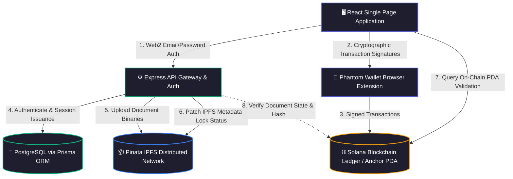
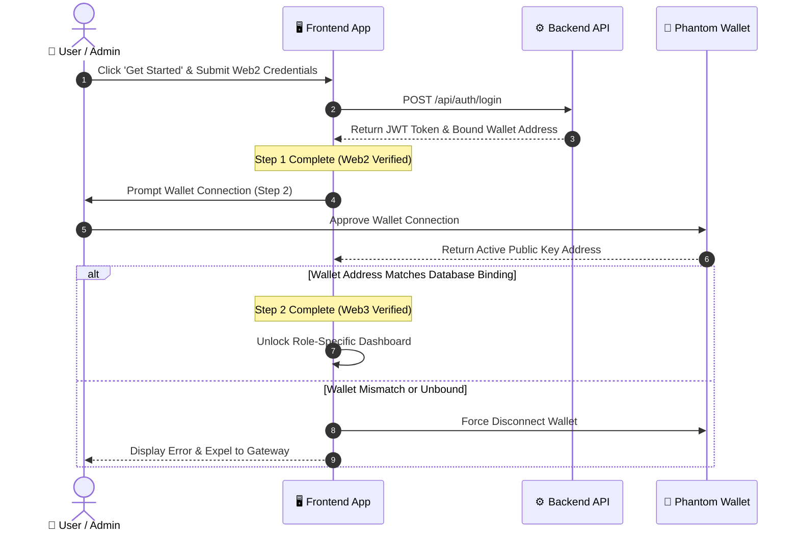
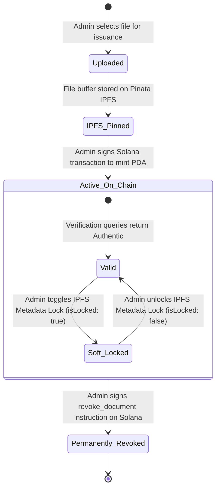

# 🛡️ ProofChain: Enterprise Decentralized Document Verification Platform

> **Decentralized Trust • Zero-Knowledge Verification • Solana Blockchain • IPFS Persistence**

ProofChain is a production-grade, decentralized verification platform designed for institutions, enterprise organizations, and educational bodies to issue, verify, and manage tamper-proof digital credentials. Built upon the high-throughput Solana blockchain, IPFS decentralized storage, and a strict Zero Trust Network Access (ZTNA) protocol, ProofChain guarantees cryptographic immutability while maintaining a frictionless user experience.

---

## 📑 Table of Contents

1. [Executive Summary & Core Architecture](#1-executive-summary--core-architecture)
2. [Key Platform Features](#2-key-platform-features)
3. [System Architecture Diagram](#3-system-architecture-diagram)
4. [Zero Trust Network Access (ZTNA) Dual-Authentication](#4-zero-trust-network-access-ztna-dual-authentication)
5. [Role-Based Access Control (RBAC) Matrix](#5-role-based-access-control-rbac-matrix)
6. [Data Model & Schema Specifications](#6-data-model--schema-specifications)
7. [REST API Endpoint Architecture](#7-rest-api-endpoint-architecture)
8. [Solana Anchor Smart Contract Specifications](#8-solana-anchor-smart-contract-specifications)
9. [Document Lifecycle & Revocation State Machine](#9-document-lifecycle--revocation-state-machine)
10. [Deployment & Operations Guide](#10-deployment--operations-guide)
11. [Production Readiness & Scalability](#11-production-readiness--scalability)

---

## 1. Executive Summary & Core Architecture

Traditional credential verification relies on centralized databases vulnerable to single points of failure, data tampering, insider threats, and administrative opacity. ProofChain replaces centralized dependency with a hybrid Web2/Web3 architecture:

- **Web2 Accessibility Layer**: Provides familiar password-based authentication, user account management, and institutional dashboards.
- **Web3 Trust Layer**: Stores document verification states on the Solana blockchain using Program Derived Addresses (PDAs) and holds raw document binaries on the InterPlanetary File System (IPFS).
- **ZTNA Security Bridge**: Enforces a strict one-to-one binding between a user's database identity and their cryptographic Solana wallet address.

---

## 2. Key Platform Features

- **Instant Public Verification**: Anyone with a document hash or QR code can instantly verify authenticity against the Solana ledger and IPFS metadata without needing an account.
- **Dual-Layer Revocation Protocol**: Allows issuers to instantly freeze document access globally via IPFS metadata key-value updates while on-chain Anchor PDA revocation settles.
- **DigiLocker-Style Personal Vault**: Standard users receive a clean, personalized dashboard containing all verified documents issued directly to their registered identity.
- **Strict Role Isolation**: Completely segregates Super Admin governance, Admin issuer tools, and Personal user vaults to prevent unauthorized interface traversal.
- **Concurrent Local Development**: Integrated process orchestration managing Solana local validator instances, Express backend API, and React Vite frontend simultaneously.

---

## 3. System Architecture Diagram

---

## 4. Zero Trust Network Access (ZTNA) Dual-Authentication

ProofChain implements a two-step authentication sequence. Users cannot access protected dashboard features unless both Web2 identity and Web3 wallet possession are verified.

---

## 5. Role-Based Access Control (RBAC) Matrix

| Platform Feature / Navigation Route | Super Admin | Admin (Issuer) | Standard User | Unauthenticated Public |
| :--- | :--- | :--- | :--- | :--- |
| **Public Document Verifier** (`/verify`) | ❌ Excluded | ❌ Excluded | ✅ Accessible | ✅ Accessible |
| **Personal Vault / DigiLocker** (`/dashboard?tab=overview`) | ❌ Excluded | ❌ Excluded | ✅ Accessible | ❌ Blocked |
| **Issue Document Panel** (`/dashboard?tab=issue`) | ❌ Excluded | ✅ Accessible | ❌ Blocked | ❌ Blocked |
| **Issued Certificates Log** (`/dashboard?tab=admin_stats`) | ❌ Excluded | ✅ Accessible | ❌ Blocked | ❌ Blocked |
| **Global Analytics Overview** (`/dashboard?tab=overview`) | ✅ Accessible | ❌ Excluded | ❌ Excluded | ❌ Blocked |
| **User Role Governance** (`/dashboard?tab=users`) | ✅ Accessible | ❌ Excluded | ❌ Excluded | ❌ Blocked |
| **Multi-Sig Governance Panel** (`/dashboard?tab=requests`) | ✅ Accessible | ❌ Excluded | ❌ Excluded | ❌ Blocked |

---

## 6. Data Model & Schema Specifications

The database layer serves as a high-speed indexer linking Web2 user records to decentralized storage references.

### User Table (`User`)
- **`id`**: Unique UUID primary identifier.
- **`email`**: Unique institutional email address used for Web2 login.
- **`username`**: Unique handle for platform identity.
- **`passwordHash`**: Bcrypt hash of account password (never returned in API responses).
- **`role`**: Access tier (`SUPER_ADMIN`, `ADMIN`, `USER`).
- **`status`**: Account approval state (`ACTIVE`, `PENDING`, `SUSPENDED`).
- **`walletAddress`**: Unique Solana wallet public key address bound to this user.

### Document Table (`Document`)
- **`id`**: Unique UUID primary key.
- **`docHash`**: SHA-256 cryptographic hash of the document file.
- **`ipfsCid`**: Content Identifier pointing to the Pinata IPFS file pinning.
- **`name`**: Human-readable title of the certificate/document.
- **`ownerEmail`**: Email address of the user to whom the document was issued.
- **`issuerId`**: Foreign key pointing to the Admin user who generated the document.
- **`createdAt`**: ISO timestamp of document creation.

### MultiSig Request Table (`MultiSigRequest`)
- **`id`**: Unique UUID primary key.
- **`docHash`**: Target document hash requiring multi-admin authorization.
- **`ipfsCid`**: IPFS content identifier of draft document.
- **`requestedBy`**: Foreign key to initiating Admin.
- **`status`**: State of request (`PENDING`, `APPROVED`, `REJECTED`).
- **`approvals`**: Count of collected cryptographic signatures.

---

## 7. REST API Endpoint Architecture

### Authentication Endpoints (`/api/auth`)
- `POST /api/auth/register`: Public registration creating standard `USER` accounts.
- `POST /api/auth/login`: Authenticates Web2 credentials and returns signed JWT.
- `POST /api/auth/link-wallet`: Binds a Solana wallet public key to the authenticated user account.
- `GET /api/auth/me`: Returns session state and role metadata for active token.

### Document Endpoints (`/api/documents`)
- `GET /api/documents`: Fetches documents filtered by active user role.
- `POST /api/documents/upload`: Admin endpoint to upload file binary to IPFS and save record.
- `POST /api/documents/:hash/lock`: Admin endpoint to toggle IPFS metadata lock state.
- `GET /api/documents/public/:hash/status`: Public endpoint to inspect metadata lock status prior to on-chain verification.

### Super Admin Endpoints (`/api/superadmin`)
- `GET /api/superadmin/dashboard`: Fetches platform analytics (user counts, issue stats).
- `GET /api/superadmin/users`: Lists all system users and their bound wallet addresses.
- `PUT /api/superadmin/users/:id/role`: Promotes or demotes user role (`USER` <-> `ADMIN`).
- `PUT /api/superadmin/users/:id/status`: Updates user status (`ACTIVE`, `SUSPENDED`).

---

## 8. Solana Anchor Smart Contract Specifications

The ProofChain on-chain program (`proofchain`) is written in Rust using the Anchor framework.

### Program Derived Address (PDA) Structure
The document account PDA is derived deterministically using seeds:
- Seed 1: `"document"` (Literal string byte array)
- Seed 2: `doc_hash` (32-byte SHA-256 hash array of the document)

### Account State Data (`DocumentAccount`)
- `issuer`: Public key of the Admin authority who registered the document.
- `doc_hash`: 32-byte SHA-256 document hash.
- `ipfs_cid`: String representation of IPFS Content Identifier.
- `is_revoked`: Boolean flag indicating permanent revocation status.
- `created_at`: Unix timestamp recorded at slot execution time.

### Instructions
1. `register_document`: Derives PDA, verifies issuer signature, and initializes account state.
2. `revoke_document`: Validates that transaction signer matches `account.issuer`, then sets `is_revoked = true`.

---

## 9. Document Lifecycle & Revocation State Machine

---

## 10. Deployment & Operations Guide

### Environment Configuration
The platform requires configured environment variables across tiers:
- **Backend**: Database connection string (`DATABASE_URL`), JWT secret key (`JWT_SECRET`), Pinata API credentials (`PINATA_API_KEY`, `PINATA_SECRET_KEY`).
- **Frontend**: Solana network RPC endpoint (`VITE_SOLANA_RPC_URL`), Anchor Program ID (`VITE_PROGRAM_ID`).

### Unified Local Cluster
Start local validator, backend service, and frontend web server concurrently:
- Execute `npm run dev:all` from root directory.

### Genesis Super Admin Setup
To create the initial Super Admin account with a bound wallet address:
- Execute `node backend/seed_superadmin.js` with parameters for email, username, password, and wallet address.

---

## 11. Production Readiness & Scalability

- **Database Connection Pooling**: Configured with Prisma and PgBouncer for serverless scalability.
- **Client-Side Cryptographic Execution**: Heavy transaction signing happens directly in user wallets, keeping server resource usage minimal under heavy traffic.
- **IPFS Fallback Gateways**: Configured with custom gateway domain aliases to handle traffic spikes.
- **Zero Comment Maintenance**: Codebase enforces strict self-documenting code standards across all source files.
