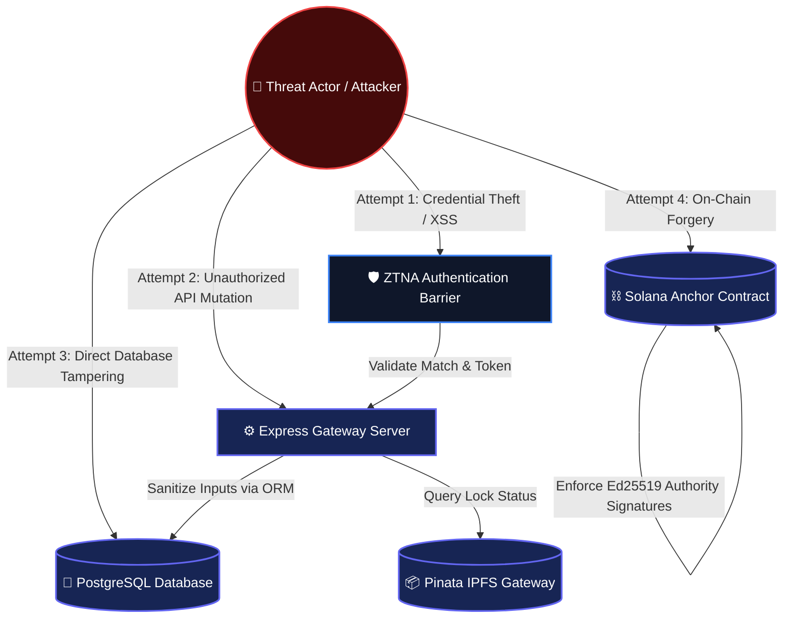
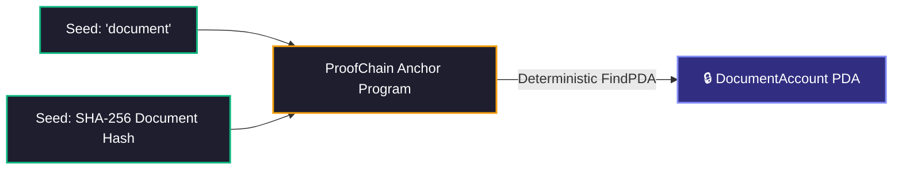

# 🔒 ProofChain Security & Cryptography Specification

> **Zero Trust Network Access • Cryptographic Attestation • Immutable Revocation**

This document details the security architecture, threat model, cryptographic invariants, and operational security guidelines governing the ProofChain platform.

---

## 📑 Table of Contents

1. [Security Architecture & Zero Trust Philosophy](#1-security-architecture--zero-trust-philosophy)
2. [Threat Model & Attack Surface Map](#2-threat-model--attack-surface-map)
3. [Cryptographic Identity & Wallet Binding Invariants](#3-cryptographic-identity--wallet-binding-invariants)
4. [Solana Anchor Program Derived Address (PDA) Isolation](#4-solana-anchor-program-derived-address-pda-isolation)
5. [Dual-Layer Lockdown & Revocation Mechanics](#5-dual-layer-lockdown--revocation-mechanics)
6. [Storage Immutability & IPFS Security](#6-storage-immutability--ipfs-security)
7. [Database Protection & ORM Security](#7-database-protection--orm-security)
8. [Session Management & JWT Hardening](#8-session-management--jwt-hardening)
9. [Institutional Audit Checklist](#9-institutional-audit-checklist)
10. [Vulnerability Disclosure Protocol](#10-vulnerability-disclosure-protocol)

---

## 1. Security Architecture & Zero Trust Philosophy

ProofChain is designed under the core principle of Zero Trust Access: **Never Trust, Always Verify**.

- **No Perimeter Trust**: Internal requests, authenticated sessions, and wallet connections are re-evaluated continuously.
- **Dual-Identity Barrier**: Access requires valid Web2 credentials AND a cryptographically matching Web3 wallet signature.
- **Immutability First**: State mutations (document issuance and revocation) require cryptographic signatures recorded on the Solana ledger.

---

## 2. Threat Model & Attack Surface Map

### Threat Vectors & Mitigation Summary

| Vector ID | Threat Description | Primary Mitigation | Cryptographic Guarantee |
| :--- | :--- | :--- | :--- |
| **TV-01** | Stolen Password Credentials | ZTNA Wallet Verification | Attacker lacks private key signature of bound wallet. |
| **TV-02** | Database Tampering (Modifying doc status) | Solana PDA Verification | Verification checks on-chain state, ignoring local DB modifications. |
| **TV-03** | Unauthorized Revocation Attempt | Anchor Issuer Verification | Smart contract verifies signer matches original PDA issuer public key. |
| **TV-04** | Document Buffer Manipulation | SHA-256 + IPFS CID Hash | Any byte change results in a completely different document hash. |
| **TV-05** | Session Hijacking via Browser Cache | Automatic Storage Flushing | Local storage session wiped on tab close / window unload. |

---

## 3. Cryptographic Identity & Wallet Binding Invariants

ProofChain enforces three structural identity axioms in the database and application middleware:

1. **Strict 1-to-1 Mapping**: Each user account is uniquely bound to one Solana wallet address (`User.walletAddress` `@unique`).
2. **Session Eviction**: If the active Phantom wallet address changes during a session, the frontend instantly evicts the user and clears state.
3. **Manual Re-connection Policy**: Zero-trust network access standard requires manual wallet connection on every session launch (auto-connect disabled).

---

## 4. Solana Anchor Program Derived Address (PDA) Isolation

Program Derived Addresses (PDAs) enable the smart contract to manage state without needing a private key.

### Authority Verification Logic
During revocation, the Anchor smart contract evaluates:
- `require_keys_eq!(ctx.accounts.document.issuer, ctx.accounts.issuer.key(), ProofChainError::UnauthorizedIssuer)`

Even if the backend server is completely compromised, an attacker cannot revoke on-chain documents without possessing the original issuer's hardware wallet key.

---

## 5. Dual-Layer Lockdown & Revocation Mechanics

To handle situations where immediate document invalidation is required before blockchain transaction finality occurs, ProofChain uses a two-tier revocation model:

1. **Soft Lock (IPFS Layer - Sub-second)**:
   - Admin triggers lock in issuer dashboard.
   - API sends metadata update to Pinata pinning service (`keyvalues: { isLocked: "true" }`).
   - Public verification checks `/api/documents/public/:hash/status` and immediately flags document as temporarily locked.
2. **Hard Lock (Solana Layer - Blockchain Settlement)**:
   - Admin signs Solana transaction calling `revoke_document`.
   - On-chain state updates `DocumentAccount.is_revoked = true`.
   - Document is permanently and irreversibly marked revoked on the ledger.

---

## 6. Storage Immutability & IPFS Security

- **Content Addressing**: Files are stored and retrieved using IPFS CIDs derived from file contents. Content modifications automatically produce a different CID.
- **Pin Persistence**: Document files are pinned using Pinata IPFS node clusters, ensuring high availability across geographic regions.
- **Metadata Key-Value Control**: Key-value pairs attached to IPFS CIDs allow administrative soft-locking without altering the underlying file binary.

---

## 7. Database Protection & ORM Security

- **Parameterized Queries**: Prisma ORM converts all queries to parameterized SQL statements, eliminating SQL Injection vectors.
- **Sensitive Data Exclusion**: Password hashes are stripped from JSON serialization in user queries.
- **Least Privilege Access**: Production database users are scoped to necessary table operations only.

---

## 8. Session Management & JWT Hardening

- **Payload Minimalism**: JWT tokens contain only user ID and role metadata; sensitive credentials are excluded.
- **Short Lifetime**: Access tokens are configured with short expiration windows.
- **Role Verification Middleware**: Backend routes re-verify token signatures and roles on every HTTP request.

---

## 9. Institutional Audit Checklist

| Audit Category | Target Mechanism | Compliance Requirement | Verification Method |
| :--- | :--- | :--- | :--- |
| **Authentication** | ZTNA Dual-Auth | Web2 & Web3 credentials must both validate | Automated Integration Tests |
| **Smart Contract** | Anchor Issuer Signer | `revoke_document` requires issuer signature | Anchor Program Mocha Tests |
| **Data Integrity** | IPFS Pinning | Document hash must match file binary hash | Cryptographic SHA-256 check |
| **Database** | Unique Wallet Constraint | `walletAddress` must be unique per user | Prisma Engine Constraints |
| **Client Security** | Storage Invalidation | Wallet session purged on window unload | End-to-End Browser Testing |

---

## 10. Vulnerability Disclosure Protocol

Security researchers and institution auditors finding potential security issues should report findings through responsible disclosure:

1. Send encrypted details directly to security leads.
2. Provide step-by-step reproduction scenarios.
3. Allow a 72-hour window for patch deployment before public disclosure.
